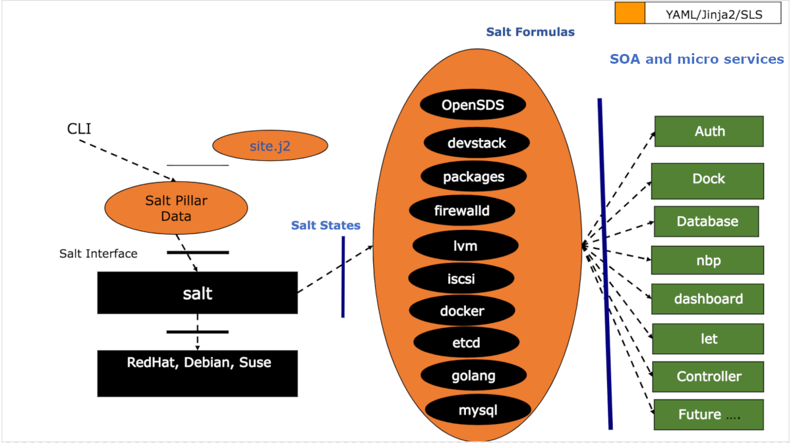

================
opensds-formula
================

Deploy 'Bali' release of OpenSDS (www.opensds.io) using the ``opensds`` state.

.. note::

    See the full `Salt Formulas installation and usage instructions
    <http://docs.saltstack.com/en/latest/topics/development/conventions/formulas.html>`_.

Architecture design
===================

Available META states
======================

.. contents::
    :local:

``opensds``
------------

Runs all the other states in the formula. This state is used by the ``OpenSDS-installer/salt`` module.

``opensds.envs``
-----------------

Deploy os profile (PATHS) and environmental dependencies (devstack, packages, docker) via salt.

``opensds.controller``
-----------------

Deploy opensds controller

``opensds.auth``
-----------------

Deploy authentication service (default keystone).

``opensds.database``
-----------------

Deploy database service (default etcd).

``opensds.dock``
-----------------

Deploy osdsdock service.

``opensds.nbp``
-----------------

Deploy osdsnbp service.

``opensds.let``
-----------------

Deploy osdslet service.

Site-specific Data Collection
================

The ``site.j2`` and ``pillar.example`` files contain required pillars!

Optionally update ``site.j2`` parameters to reflect your site specific parameters.

Prerequisite
==============

Prepare your environment by running the ``salt.formulas`` state from ``https://github.com/saltstack-formulas/salt-formula``.
The following ``pillar.example`` extract is suggested::

        salt:
          master:
            file_roots:
              base:
                - /srv/salt
            pillar_roots:
              base:
                - /srv/pillar
          minion:
            file_roots:
              base:
                - /srv/salt
            pillar_roots:
              base:
                - /srv/pillar
          ssh_roster:
            controller1:
              host: {{ grains.ipv4 or grains.ipv6 }}
              user: stack
              sudo: True
              priv: /etc/salt/ssh_keys/sshkey.pem
        salt_formulas:
          git_opts:
            default:
              baseurl: https://github.com/saltstack-formulas
              basedir: /srv/formulas
          basedir_opts:
            makedirs: True
            user: root
            group: root
            mode: 755
          minion_conf:
            create_from_list: True
          list:
            base:
             {{ '- epel-formula' if grains.os_family in ('RedHat',) else '' }}
             - salt-formula
             - openssh-formula
             - packages-formula
             - firewalld-formula
             - etcd-formula
             - ceph-formula
             - deepsea-formula
             - docker-formula
             - etcd-formula
             - firewalld-formula
             - helm-formula
             - iscsi-formula
             - lvm-formula
             - packages-formula
             - devstack-formula
             - golang-formula
             - memcached-formula
             - opensds-formula
             - timezone-formula
             - resolver-formula
             - nginx-formula
             - mysql-formula
             - mongodb-formula

